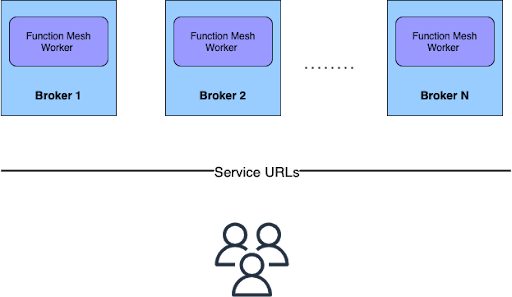

This document describes how to deploy the Function Mesh Worker service. 

> **Limitations**
>
> - Function Mesh Worker service is only available for Pulsar 2.8.0 or higher.
> - Function Mesh Worker service cannot manage the FunctionMesh CRD.
> - You need to configure the `clusterName`, `inputTypeClassName`, `outputTypeClassName` parameters through the `custom-runtime-options` option when creating or updating Pulsar functions or connectors.
> - You need to manually manage the [`ConfigMap`](/functions/function-crd.md#cluster-location), such as the Pulsar service URL.
> - A Pulsar cluster with the Function Mesh Worker service should be the same Kubernetes cluster where the Function Mesh Operator is deployed.

## Prerequisite

To deploy the Function Mesh Worker service, ensure that these services are already running in your environment.

- Apache Pulsar cluster (v2.8.0 or higher version)
- Function Mesh operator

## Deploy Function Mesh Worker service with Pulsar brokers

The following diagram illustrates how to deploy the Function Mesh Worker service along with Pulsar brokers.



Function Mesh Worker service can forward requests to the Kubernetes cluster. After you start the Function Mesh Worker service, you can use the [`pulsar-admin`](https://pulsar.apache.org/docs/en/pulsar-admin/) CLI tool to manage Pulsar functions and connectors.

### Configure Function Mesh Worker service

You can customize the Function Mesh Worker service using `functionsWorkerServiceCustomConfigs` in the `functions_worker.yml` manifest. This table lists available configurations.

| Name | Type | Required | Default | Description |
|----|----|---|---|---|
| `uploadEnabled` | boolean | No | false | Enable users to upload custom JAR or NAR packages of Pulsar functions, source, or sink connectors. |
| `functionEnabled` | boolean | No | true | Enable the Pulsar Function API endpoint. |
| `sinkEnabled` | boolean | No | true | Enable the sink API endpoint. |
| `sourceEnabled` | boolean | No | true | Enable the source API endpoint. |
| `extraDependenciesDir` | string | No | /pulsar/lib/ | The directory for dropping extra function dependencies. |
| `volumeMounts` | List < V1VolumeMount > | No | [] (empty string)| [V1VolumeMount](https://github.com/kubernetes-client/java/blob/master/kubernetes/docs/V1VolumeMount.md) describes a mounting of a Volume within a container. |
| `volumes` | List < V1Volume > | No | [] (empty string) | The list of [V1Volume](https://github.com/kubernetes-client/java/blob/master/kubernetes/docs/V1Volume.md) that can be mounted by containers belonging to the Pulsar Function or connector Pod. |
| `ownerReference` | V1OwnerReference | No | null | Default configurations of the [`ownerReference`](https://github.com/kubernetes-client/java/blob/master/kubernetes/docs/V1OwnerReference.md). |
| `allowUserDefinedServiceAccountName` | boolean | No | false | Enable users to change the service account name with `custom-runtime-options`. |
| `defaultServiceAccountName` | string | No | "" (empty string) | The name of the service account to run the Pulsar Function or connector Pod. |
| `imagePullPolicy` | string | No | "IfNotPresent" | The image pull policy for images to run Pulsar Function instances. By default, it is set to `IfNotPresent`. |
| `functionRunnerImages` | Map < String, String > | No | {} (empty string)| The runner image to run the Pulsar Function instances. |
| `imagePullSecrets` | List< V1LocalObjectReference > | No | [] (empty string) | An optional list of references to secrets in the same namespace to pull images used by `PodSpec`. |
| `labels` | Map < String, String > | No | {} (empty string) | Specify the labels being attached to a Pod that is created by the Function Mesh Operator for the cluster. |
| `functionLabels` | Map < String, String > | No | {} (empty string) | Specify the labels being attached to a Function's Pod. When both `functionLabels` and `labels` are specified, `functionLabels` overrides `labels`. |
| `sinkLabels` | Map < String, String > | No | {} (empty string) | Specify the labels being attached to a Sink's Pod. When both `sinkLabels` and `labels` are specified, `sinkLabels` overrides `labels`. |
| `sourceLabels` | Map < String, String > | No | {} (empty string) | Specify the labels being attached to a Source's Pod. When both `sourceLabels` and `labels` are specified, `sourceLabels` overrides `labels`. |
| `annotations` | Map < String, String > | No | {} (empty string) | Specify the annotations being attached to a Pod that is created by the Function Mesh Operator for the cluster. |
| `functionAnnotations` | Map < String, String > | No | {} (empty string) | Specify the annotations being attached to a Function's Pod. When both `functionAnnotations` and `annotations` are specified, `functionAnnotations` overrides `annotations`. |
| `sinkAnnotations` | Map < String, String > | No | {} (empty string) | Specify the annotations being attach to a Sink's Pod. When both `sinkAnnotations` and `annotations` are specified, `sinkAnnotations` overrides `annotations`. |
| `sourceAnnotations` | Map < String, String > | No | {} (empty string) | Specify the annotations being attach to a Source's Pod. When both `sourceAnnotations` and `annotations` are specified, `sourceAnnotations` overrides `annotations`. |

### Start Function Mesh Worker service

This section describes how to start the Function Mesh Worker service after you configure it.

To start the Function Mesh Worker service, follow these steps.

1. Download the released Function Mesh Worker service NAR package from the [download page](https://github.com/streamnative/function-mesh/releases) and add the downloaded NAR package to your broker.

2. Configure the Function Mesh Worker service.

   - Add the following Function Mesh Worker service configuration to your `functions_worker.yml` configuration file.

       ```bash
       functionsWorkerServiceNarPackage: /YOUR-NAR-PATH/function-mesh-worker-service-{version}.nar
       ```

       Replace the `YOUR-NAR-PATH` variable with your real local path.

   - Add `functionsWorkerServiceCustomConfigs` to your `functions_worker.yml` configuration file.

        This is a sample. For details about available configurations of Function Mesh Worker service, see [Configure Function Mesh Worker service](#configure-the-function-mesh-worker-service).

        ```yaml
        functionsWorkerServiceCustomConfigs:
        uploadEnabled: true
        functionEnabled: true
        sinkEnabled: true
        sourceEnabled: true
        volumeMounts:
          - mountPath: /mnt/secrets
          name: secret-pulsarcluster-data
          readOnly: true
        volumes:
          - name: secret-pulsarcluster-data
          secret:
            defaultMode: 420
            secretName: pulsarcluster-data
        extraDependenciesDir: /pulsar/lib/*
        ownerReference:
          apiVersion: pulsar.streamnative.io/v1alpha1
          blockOwnerDeletion: true
          controller: true
          kind: PulsarBroker
          name: test
          uid: 4627a402-35f2-40ac-b3fc-1bae5a2bd626
        defaultServiceAccountName: "service-account"
        imagePullPolicy: "always"
        imagePullSecrets:
          - name: "registry-secret"
        functionRunnerImages:
          "JAVA": streamnative/pulsar-functions-java-runner
          "PYTHON": streamnative/pulsar-functions-python-runner
          "GO": streamnative/pulsar-functions-go-runner
        ```

3. (Optional) Add the built-in connector list as a built-in connectors list file.

    If you want to use connectors as a built-in connector and view these connectors using the `pulsar-admin sinks available-sinks` or `pulsar-admin sources available-sources` command, you need to define a built-in connectors list file `/pulsar/conf/connectors.yaml`. For details, see [this sample file](https://github.com/streamnative/function-mesh/blob/master/mesh-worker-service/src/main/resources/connectors.yaml). You can also find the available connectors on the [StreamNative Hub](https://hub.streamnative.io/).

4. Restart Pulsar cluster to apply the above changes.

    This example shows how to start Pulsar through Helm.

    ```bash
    helm install \
      --values /path/to/pulsar/file.yaml
      --set initialize=true \
      --namespace <k8s_namespace> \
      pulsar-mini <release_name>
    ```

5. Verify that the Function Mesh Worker service is started successfully with the `pulsar-admin` CLI tool.

    ```bash
    ./bin/pulsar-admin --admin-url  <web_service_url> functions status --tenant <tenant_name> --namespace <namespace_name> --name <function_name>
    ```

    The output is similar to:

    **Output**

    ```bash
    {
    "numInstances" : 1,
    "numRunning" : 1,
    "instances" : [ {
      "instanceId" : 0,
      "status" : {
      "running" : true,
      "error" : "",
      "numRestarts" : 0,
      "numReceived" : 0,
      "numSuccessfullyProcessed" : 0,
      "numUserExceptions" : 0,
      "latestUserExceptions" : [ ],
      "numSystemExceptions" : 0,
      "latestSystemExceptions" : [ ],
      "averageLatency" : 0.0,
      "lastInvocationTime" : 0,
      "workerId" : ""
      }
    } ]
    }
    ```