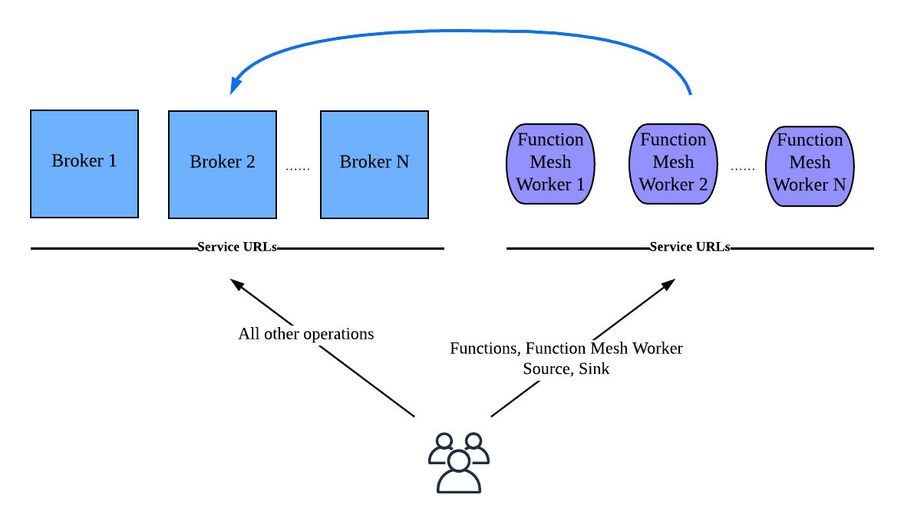

This document describes how to deploy the Function Mesh Worker service. 

> **Limitations**
>
> - Function Mesh Worker service is only available for Pulsar 2.8.0 or higher.
> - Function Mesh Worker service cannot manage the FunctionMesh CRD.
> - You need to configure the `clusterName`, `inputTypeClassName`, `outputTypeClassName` parameters through the `custom-runtime-options` option when creating or updating Pulsar functions or connectors.
> - You need to manually manage the [`ConfigMap`](/functions/function-crd.md#cluster-location), such as the Pulsar service URL.
> - A Pulsar cluster with the Function Mesh Worker service should be the same Kubernetes cluster where the Function Mesh Operator is deployed.

## Deploy Function Mesh Worker service separately

When you want to isolate resources for running the Function Mesh Worker service and the Pulsar brokers, you can run the Function Mesh Worker service separately. In this case, even if the Function Mesh Worker service fails, the Pulsar brokers can work properly without causing data loss or service interruption.

The following diagram illustrates how to deploy the Function Mesh Worker service in separate machines.



### Run Function Mesh Worker service in Docker

This section describes how to run Function Mesh Worker service separately in Docker.

#### Prerequisites

- Install Docker. Download the [Community edition](https://www.docker.com/community-edition) and follow the instructions for your OS.
- [Deploy a Pulsar cluster](https://pulsar.apache.org/docs/next/getting-started-docker) (v2.8.0 or higher version).
- [Install Function Mesh](/docs/install-function-mesh.md).

#### Steps

To start the Function Mesh Worker service in Docker, follow these steps.

1. Download the released Function Mesh Worker service NAR package from the [download page](https://github.com/streamnative/function-mesh/releases).

2. Configure the Function Mesh Worker service.

      - Add the following Function Mesh Worker service configuration to your `functions_worker.yml` configuration file.

        ```yaml
        functionsWorkerServiceNarPackage: /YOUR-NAR-PATH/function-mesh-worker-service-{version}.nar
        ```

        Replace the `YOUR-NAR-PATH` variable with your real local path.

     - Update the ZooKeeper and Broker URLs in your `functions_worker.yml` configuration file.

        ```yaml
        configurationStoreServers: localhost:2181
        pulsarServiceUrl: pulsar://localhost:6650
        pulsarWebServiceUrl: http://localhost:8080
        ```

3. Start the Function Mesh Worker service in Docker.

    You must provide the `KUBE_CONFIG` environment variable and mount related volumes to the container to manage resources in the target Kubernetes cluster.

      ```bash
      docker run -td --name worker -p 6750:6750 \
      -v /YOUR-CONF/functions_worker.yml:/pulsar/conf/functions_worker.yml \
      -v /YOUR-NAR-PATH/:/ANY-PATH \
      -v /YOUR-KUBE-CONFIG:/kube/config \
      -e KUBE_CONFIG=/kube/config \
      apachepulsar/pulsar:{pulsar_version} bin/pulsar functions-worker
      ```

4. Verify that the Function Mesh Worker service is started successfully with the `pulsar-admin` CLI tool.

    To ensure the Function Mesh worker service and the `pulsar-admin` CLI tool work together, you should start a Pulsar Proxy. For details, see [configure Pulsar Proxy](https://pulsar.apache.org/docs/next/functions-worker-run-separately#configure-proxies-for-standalone-function-workers).

    ```bash
    ./bin/pulsar-admin --admin-url  <web_service_url> functions status --tenant <tenant_name> --namespace <namespace_name> --name <function_name>
    ```

    The output is similar to:

    **Output**

    ```bash
    {
    "numInstances" : 1,
    "numRunning" : 1,
    "instances" : [ {
      "instanceId" : 0,
      "status" : {
      "running" : true,
      "error" : "",
      "numRestarts" : 0,
      "numReceived" : 0,
      "numSuccessfullyProcessed" : 0,
      "numUserExceptions" : 0,
      "latestUserExceptions" : [ ],
      "numSystemExceptions" : 0,
      "latestSystemExceptions" : [ ],
      "averageLatency" : 0.0,
      "lastInvocationTime" : 0,
      "workerId" : ""
      }
    } ]
    }
    ```

### Run Function Mesh Worker service in Kubernetes

This section describes how to run Function Mesh Worker service separately in Kubernetes.

#### Prerequisites

- Install [kubectl](https://kubernetes.io/docs/tasks/tools/#kubectl).
- [Prepare a running Kubernetes cluster](https://kubernetes.io/docs/setup/).
- [Deploy a Pulsar cluster](https://pulsar.apache.org/docs/next/getting-started-helm) (v2.8.0 or higher version).
- [Install Function Mesh](/docs/install-function-mesh.md).

#### Steps

To start the Function Mesh Worker service in Kubernetes, follow these steps.

1. Define a YAML file for the Function Mesh Worker service.

    This is a sample [YAML file](https://github.com/streamnative/function-mesh-worker-service/blob/master/examples/standalone.yaml). You can customize the file according to your configuration.

2. (Optional) If you want to use another Kubernetes cluster to manage Function Mesh resources, you must use the `env` field to add the `KUBE_CONFIG` environment variable and related volume to the Pod.

    ```yaml
    ...
    env:
      - name: KUBE_CONFIG
        value: /kube/config
    ...
    volumeMounts:
      - name: outside-k8s-config
        mountPath: /kube/config
        subPath: config
    ...
    volumes:
      - name: outside-k8s-config
        secret:
          secretName: k8s-config # create your own secret for k8s config
          items:
          - key: config
            path: config
    ...
    ```

3. Apply the YAML file to start the Function Mesh Worker service.

    ```bash
    kubectl apply -f standalone.yaml 
    ```

4. Verify that the Function Mesh Worker service is started successfully with the `pulsar-admin` CLI tool.

    To ensure the Function Mesh worker service and the `pulsar-admin` CLI tool work together, you should start a Pulsar Proxy. For details, see [configure Pulsar Proxy](https://pulsar.apache.org/docs/next/functions-worker-run-separately#configure-proxies-for-standalone-function-workers).

    ```bash
    ./bin/pulsar-admin --admin-url  <web_service_url> functions status --tenant <tenant_name> --namespace <namespace_name> --name <function_name>
    ```

    The output is similar to:

    **Output**

    ```bash
    {
    "numInstances" : 1,
    "numRunning" : 1,
    "instances" : [ {
      "instanceId" : 0,
      "status" : {
      "running" : true,
      "error" : "",
      "numRestarts" : 0,
      "numReceived" : 0,
      "numSuccessfullyProcessed" : 0,
      "numUserExceptions" : 0,
      "latestUserExceptions" : [ ],
      "numSystemExceptions" : 0,
      "latestSystemExceptions" : [ ],
      "averageLatency" : 0.0,
      "lastInvocationTime" : 0,
      "workerId" : ""
      }
    } ]
    }
    ```

## Deploy Function Mesh Worker service with Pulsar brokers

The following diagram illustrates how to deploy the Function Mesh Worker service along with Pulsar brokers.


Function Mesh Worker service can forward requests to the Kubernetes cluster. After you start the Function Mesh Worker service, you can use the [`pulsar-admin`](https://pulsar.apache.org/docs/en/pulsar-admin/) CLI tool to manage Pulsar functions and connectors.

### Prerequisite

To deploy the Function Mesh Worker service, ensure that these services are already running in your environment.

- [Deploy a Pulsar cluster](https://pulsar.apache.org/docs/next/getting-started-helm) (v2.8.0 or higher version).
- [Install Function Mesh](/docs/install-function-mesh.md).

### Start Function Mesh Worker service

This section describes how to start the Function Mesh Worker service after you configure it.

To start the Function Mesh Worker service, follow these steps.

1. Download the released Function Mesh Worker service NAR package from the [download page](https://github.com/streamnative/function-mesh/releases) and add the downloaded NAR package to your broker.

2. Configure the Function Mesh Worker service.

   - Add the following Function Mesh Worker service configuration to your `functions_worker.yml` configuration file.

       ```bash
       functionsWorkerServiceNarPackage: /YOUR-NAR-PATH/function-mesh-worker-service-{version}.nar
       ```

       Replace the `YOUR-NAR-PATH` variable with your real local path.

   - Add `functionsWorkerServiceCustomConfigs` to your `functions_worker.yml` configuration file.

        This is a sample. For details about available configurations of Function Mesh Worker service, see [general options](/function-mesh-worker/reference/general-option.md).

        ```yaml
        functionsWorkerServiceCustomConfigs:
        uploadEnabled: true
        functionEnabled: true
        sinkEnabled: true
        sourceEnabled: true
        volumeMounts:
          - mountPath: /mnt/secrets
          name: secret-pulsarcluster-data
          readOnly: true
        volumes:
          - name: secret-pulsarcluster-data
          secret:
            defaultMode: 420
            secretName: pulsarcluster-data
        extraDependenciesDir: /pulsar/lib/*
        ownerReference:
          apiVersion: pulsar.streamnative.io/v1alpha1
          blockOwnerDeletion: true
          controller: true
          kind: PulsarBroker
          name: test
          uid: 4627a402-35f2-40ac-b3fc-1bae5a2bd626
        defaultServiceAccountName: "service-account"
        imagePullPolicy: "always"
        imagePullSecrets:
          - name: "registry-secret"
        functionRunnerImages:
          "JAVA": streamnative/pulsar-functions-java-runner
          "PYTHON": streamnative/pulsar-functions-python-runner
          "GO": streamnative/pulsar-functions-go-runner
        ```

3. (Optional) Add the built-in connector list as a built-in connectors list file.

    If you want to use connectors as a built-in connector and view these connectors using the `pulsar-admin sinks available-sinks` or `pulsar-admin sources available-sources` command, you need to define a built-in connectors list file `/pulsar/conf/connectors.yaml`. For details, see [this sample file](https://github.com/streamnative/function-mesh/blob/master/mesh-worker-service/src/main/resources/connectors.yaml). You can also find the available connectors on the [StreamNative Hub](https://hub.streamnative.io/).

4. Restart Pulsar cluster to apply the above changes.

    This example shows how to start Pulsar through Helm.

    ```bash
    helm install \
      --values /path/to/pulsar/file.yaml
      --set initialize=true \
      --namespace <k8s_namespace> \
      pulsar-mini <release_name>
    ```

5. Verify that the Function Mesh Worker service is started successfully with the `pulsar-admin` CLI tool.

    ```bash
    ./bin/pulsar-admin --admin-url  <web_service_url> functions status --tenant <tenant_name> --namespace <namespace_name> --name <function_name>
    ```

    The output is similar to:

    **Output**

    ```bash
    {
    "numInstances" : 1,
    "numRunning" : 1,
    "instances" : [ {
      "instanceId" : 0,
      "status" : {
      "running" : true,
      "error" : "",
      "numRestarts" : 0,
      "numReceived" : 0,
      "numSuccessfullyProcessed" : 0,
      "numUserExceptions" : 0,
      "latestUserExceptions" : [ ],
      "numSystemExceptions" : 0,
      "latestSystemExceptions" : [ ],
      "averageLatency" : 0.0,
      "lastInvocationTime" : 0,
      "workerId" : ""
      }
    } ]
    }
    ```