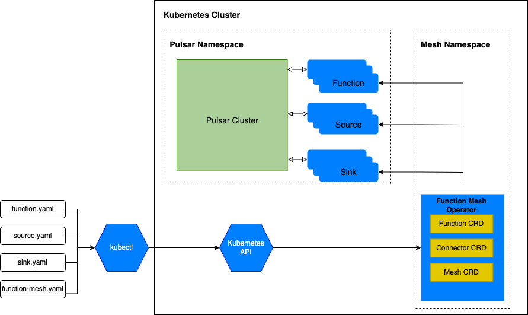

This document gives a brief introduction into Function Mesh Worker service.

## What is Function Mesh Worker service

Function Mesh Worker service is a plug-in for Pulsar. It is similar to Pulsar Function Worker service but uses Function Mesh operators to schedule and run functions. Function Mesh Worker service enables you to use the [`pulsar-admin`](https://pulsar.apache.org/docs/en/pulsar-admin/) or [`pulsarctl`](https://docs.streamnative.io/pulsarctl/v2.7.0.7/) CLI tools to manage Pulsar functions and connectors in Function Mesh.

## How Function Mesh Worker service works

The following figure illustrates how Function Mesh Worker service works with Pulsar proxy, converts and forwards function and / or connector admin requests to the Kubernetes cluster. The benefit of this approach is that you do not need to change the way you create and submit functions and / or connectors.



## Authentication Support

Before v0.6.0, the Function Mesh Worker Service uses a super admin Pulsar account reading from the config file for Function Mesh operators, which is not secure, so start from v0.6.0, there is a break change to use separate account for each user.

**Currently it only support OAuth2 providers, other providers will be supported as soon as possible.**

> NOTE: if you are using Pulsar cluster with other authentication providers, the Function Mesh Worker Service will not work

### OAuth2

For each client of OAuth2, there should be a Kubernetes Secret created in advance in the same cluster of Function Mesh operators, its format is like below:

```yaml
apiVersion: v1
data:
  auth.json: |
    {
      "client_id": "xxxx",
      "client_secret": "xxxx",
      "issuer_url": "xxx"
    }
  clientAuthenticationParameters: {"privateKey":"file:///${SOME-PATH-OF-FILE}","issuerUrl":"${OAUTH-ISSUER-URL}","audience":"${OAUTH-AUDIENCE}","scope":"${OAUTH-SCOPE}"}
kind: Secret
metadata:
  name: ${OAUTH-CLIENT-NAME}
type: Opaque
```

## Version matrix

This table lists the version mapping relationships between Function Mesh and Function Mesh Worker service.

| Function Mesh | Function Mesh Worker service |
| --- | --- |
| v0.1.9 | <br />- v2.9.1.x (v2.9.1.1-v2.9.1.2) <br />- v2.8.2.x (v2.8.2.0-v2.8.2.2) <br />- v2.8.1 x (2.8.1.25-v2.8.1.26, v.2.8.1.28-v2.8.1.30)|
| v0.1.10| <br />- v2.9.2.1+ <br />- v2.8.2.3+ |
| v0.1.11| <br />- v2.10.0+ <br />- v2.9.2.13+ <br />- v2.8.2.14+ |
| v0.2.0| <br />- v2.10.0.5-v2.10.0.6 <br />- v2.9.2.18-v2.9.2.22 <br />- v2.8.3.4 |
| v0.3.0| <br />- v2.10.0.7 <br />- v2.9.2.23+ <br />- v2.8.3.5+ |
| v0.4.0| <br />- v2.10.1.4+ <br />- v2.9.3.3+ <br />- v2.8.3.6+ |
| v0.5.0| <br />- v2.10.1.7+ <br />- v2.9.3.5+ <br />- v2.8.4.1+ |
