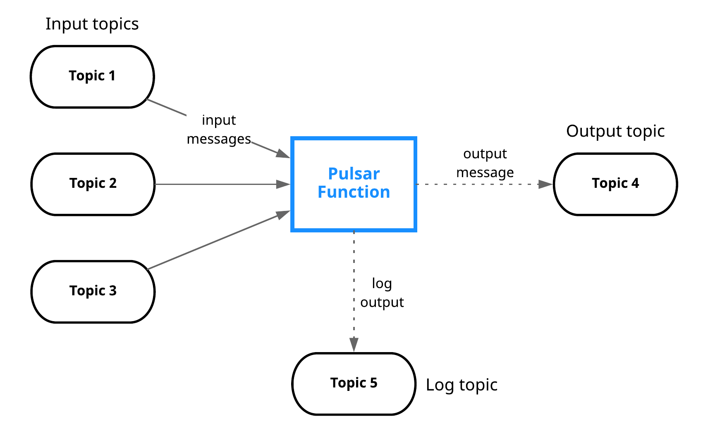

**Pulsar Functions** are lightweight compute processes that can perform the following operations:

- Consume messages from one or more Pulsar topics.

- Apply a user-supplied processing logic to each message.

- Publish the results of the computation to another topic.

Pulsar Functions are computing infrastructure of Pulsar messaging system. With Pulsar Functions, you can create complex processing logic without deploying a separate neighboring system, such as [Apache Storm](http://storm.apache.org/), [Apache Heron](https://heron.incubator.apache.org/), or [Apache Flink](https://flink.apache.org/).  

Pulsar Functions can be described as [Lambda](https://aws.amazon.com/lambda/)-style functions that are specifically designed to use Pulsar as a message bus.

## Programming model

Pulsar Functions provide a wide range of functionality, and the core programming model is simple. Functions receive messages from one or more **input topics**. After a message is received, the function completes the following tasks.

- Apply a processing logic to the input messages and write output messages to an **output topic** in Pulsar.

- Write logs to a **log topic**, which is mainly used for debugging issues.

## Processing guarantees

Pulsar Functions provide three different messaging semantics that you can apply to any function.

| Delivery semantics | Description |
| ------------------| ------- |
| **At-most-once**  | The message sent to the function is processed at most once. Therefore, there is a chance that the message is not processed.  |
| **At-least-once**  | The message sent to the function is processed more than once. Therefore, there is a chance that the message is processed redundantly. |
| **Effectively-once**  | The message sent to the function is processed only once and has one output associated with it. |

## Supported languages

Currently, you can write Pulsar Functions in Java, Python, and Go. For details, refer to [functions examples](https://github.com/streamnative/function-mesh/tree/master/config/samples).

## Pulsar Functions APIs

Pulsar Functions APIs are used to manage Pulsar Functions. For details, see [Functions APIs](https://pulsar.apache.org/functions-rest-api/).

## Stateful Functions

A stateful function is a type of Pulsar function that uses the [Apache BookKeeper](https://bookkeeper.apache.org/) [table service](https://docs.google.com/document/d/155xAwWv5IdOitHh1NVMEwCMGgB28M3FyMiQSxEpjE-Y/edit#heading=h.56rbh52koe3f) to store the **state** for functions. States are key-value pairs, where the key is a string and the value is arbitrary binary data. Keys are mapped to an individual Pulsar function and shared between instances of that function.

Stateful functions expose the APIs that simplify the building of distributed stateful stream processing applications. They bring together the benefits of Pulsar functions - the lightweight compute processing engine, and a distributed and managed state store, to support concurrency, scaling, and resiliency.

You can access states within Pulsar Java functions using the following calls on the context object:

- `putState`
- `putStateAsync`
- `getState`
- `getStateAsync`
- `incrCounter`
- `incrCounterAsync`
- `getCounter`
- `getCounterAsync`
- `deleteState`

You can access states within Pulsar Python functions using the following calls on the context object:

- `putState`
- `getState`
- `incrCounter`
- `getCounter`
- `deleteState` 

> **Note**
>
> Stateful functions are not available in the Go programming language.

## Window functions

> **Note**
>
> Currently, window functions are only available in Java and do not support `MANUAL` and `Effectively-once` delivery semantics.

A window function is a function that performs computation across a window, which is a finite subset of the event stream, as illustrated below.

There are two common attributes used to define windows:

- Eviction policy: controls the amount of data collected in a window. It is used to confirm if data should be evicted from the window.
- Trigger policy: controls when a function is triggered and executed to process all of the data collected in a window based on eviction policy. It is used by the Apache Pulsar Function framework to confirm the time to process all the data collected in a window.

Both of these policies are driven by either time or the quantity of data in a window. Although there are a variety of windowing techniques, the most prominent ones used in practice are [tumbling windows](https://pulsar.apache.org/docs/next/functions-concepts#tumbling-window) and [sliding windows](https://pulsar.apache.org/docs/next/functions-concepts#sliding-window). For details, see [Types of window](https://pulsar.apache.org/docs/next/functions-concepts#types-of-window).

### Window function context

The Java SDK provides access to a window context object that can be used by a window function. This context object provides a wide variety of information and functionality for a Pulsar window function. For details, see [Pulsar documentation](https://pulsar.apache.org/docs/next/window-functions-context).
