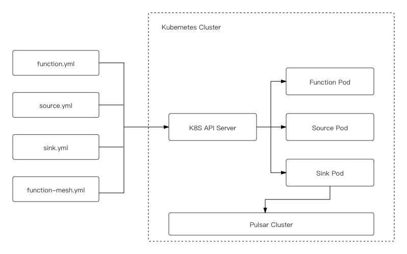

This document gives a general description about Pulsar Functions, Pulsar connectors, and Function Mesh, as well as how to run Function Mesh.

## Pulsar Functions

Pulsar Functions is a computing infrastructure native to Pulsar. It enables the creation of complex processing logic on a per message basis and brings simplicity and serverless concepts to event streaming, thereby eliminating the need to deploy a separate system.

Pulsar Functions are lightweight compute processes that can perform the following operations:

- Consume messages from one or more Pulsar topics.

- Apply a user-supplied processing logic to each message.

- Publish the results of the computation to another topic.

## Pulsar connectors

Pulsar IO, a framework that allows you to ingress or egress data from and to Pulsar using the existing Pulsar Functions framework. Pulsar IO connectors consists **source** and **sink**. A source is an application that ingests data from an external system into Pulsar, while a sink is an application that egresses data from Pulsar to an external system.

The Pulsar IO framework runs on top of the existing Pulsar functions framework. Individual sources and sinks can run like any function alongside Pulsar brokers.

However, both Pulsar Functions and Pulsar connectors have the following issues:

- Pulsar Functions and Pulsar connectors do not fully utilize all the tools provided by the Kubernetes ecosystem.

- Functions and connectors are tied to a specific Pulsar cluster and it is hard to use functions connectors across multiple Pulsar clusters.

- Currently, it is hard to manage a bundle of functions or connectors. Users have to launch and track them manually one by one.

To solve these issues, we developed Function Mesh to run Pulsar Functions in the Kubernetes environment in a native and integral way.

## Function Mesh

Function Mesh is a Kubernetes operator that enables users to run [Pulsar Functions](/functions/function-overview.md) and [connectors](/connectors/pulsar-io-overview.md) natively on Kubernetes. Function Mesh leverages the powerful scheduling functionality provided by Kubernetes to ensure that functions are resilient to failures, can be scheduled properly at any time, as well as utilize many available Kubernetes tools.

Function Mesh is a serverless framework to orchestrate multiple Pulsar Functions and I/O connectors for complex streaming jobs. Function Mesh help users organize a collection of Pulsar Functions and connectors and it simplifies the process of creating complex streaming jobs.

Function Mesh has the following components:

- Functions CRD: it is used to define Pulsar Functions, source, sink, and Function Mesh.
- Functions controller: it is used to watch the CRDs and reconcile Pulsar Functions, Source, Sink, and Function Mesh in Kubernetes.

### Features

- Be easily deployed directly on Kubernetes clusters, including [Minikube](https://github.com/kubernetes/minikube) and [Kind](https://kind.sigs.k8s.io/docs/user/quick-start/), without special dependencies.
- Use [CustomResourceDefinitions (CRD)](https://kubernetes.io/docs/concepts/extend-kubernetes/api-extension/custom-resources/) to define Functions, source, sink, and Mesh. Using CRD makes Function Mesh naturally integrate with the Kubernetes ecosystem.
- Integrate with Kubernetes secrets seamlessly to read secrets directly. This would help improve the overall security for the Pulsar Functions.
- Leverage the Kubernetes’s auto-scaler to auto-scale instances for functions based on the CPU usage. In future, Function Mesh will support auto-scaling based on the backlog.
- Utilize the full power scheduling capability provided by Kubernetes. Therefore, users do not need to write any customized codes to communicate with the Kubernetes API server.
- Allow one function to talk to multiple different Pulsar clusters, which are defined as config maps.
- Support function registry for function package management. We are going to introduce the Pulsar registry in Pulsar 2.8.0 for function package management. Then, the function package can be reused by different functions.

### Architecture

Function Mesh works in the following way.

1. Create Pulsar Functions, Source, Sink, and Function Mesh `.yaml` files as CRDs.

2. The Functions controller receives CRDs from Kubernetes service and then it schedules the individual Pod.

3. The Pod talks to Pulsar.

The benefit of this approach is that both the metadata and running state are actually stored directly on the Kubernetes API server.

The following diagram illustrates the architecture for Function Mesh.



### How to run Function Mesh

Function Mesh organizes functions, sources and sinks together and manages them as a whole. The FunctionMesh CRD has a list of fields for functions, sources and sinks and you can connect them together through the `topics` field. Once the YAML file is submitted, the FunctionMesh controller will reconcile it into multiple function/source/sink resources and delegate each of them to corresponding controllers. The function/source/sink controllers reconcile each task and launch corresponding sub-components. The FunctionMesh controller collects the status of each component from the system and aggregates them in its own status field.

This is a Function Mesh CRD example, which is used to submit the ElasticSearch sink connector and a Pulsar Functions to a Pulsar cluster.

```yaml
    apiVersion: compute.functionmesh.io/v1alpha1
    kind: FunctionMesh
    metadata:
      name: functionmesh-sample
    spec:
      sinks:
        name: sink-sample
        image: streamnative/pulsar-io-elastic-search:2.7.1 # using connector image here
        className: org.apache.pulsar.io.elasticsearch.ElasticSearchSink
        replicas: 1
        maxReplicas: 1
        input:
          topics:
          - persistent://public/default/input
          typeClassName: "[B"
        sinkConfig:
          elasticSearchUrl: "http://quickstart-es-http.default.svc.cluster.local:9200"
          indexName: "my_index"
          typeName: "doc"
          username: "elastic"
          password: "wJ757TmoXEd941kXm07Z2GW3"
        pulsar:
          pulsarConfig: "test-sink"
        resources:
          limits:
            cpu: "0.2"
            memory: 1.1G
          requests:
            cpu: "0.1"
            memory: 1G
        java:
          jar: connectors/pulsar-io-elastic-search-2.7.1.nar # the NAR location in image
          jarLocation: "" # leave empty since we will not download package from Pulsar Packages
        clusterName: test-pulsar
        autoAck: true
      functions:
        name: ex1
        className: org.apache.pulsar.functions.api.examples.ExclamationFunction
        replicas: 1
        maxReplicas: 1
        logTopic: persistent://public/default/logging-function-log
        input:
          topics:
            - persistent://public/default/functionmesh-input-topic
          typeClassName: java.lang.String
        output:
          topic: persistent://public/default/mid-topic
          typeClassName: java.lang.String
        pulsar:
          pulsarConfig: "mesh-test-pulsar"
        java:
          jar: pulsar-functions-api-examples.jar
          jarLocation: public/default/nlu-test-functionmesh-ex1
        # following value must be provided if no auto-filling is enabled
        forwardSourceMessageProperty: true
        autoAck: true
        resources:
          requests:
            cpu: "0.1"
            memory: 1G
          limits:
            cpu: "0.2"
            memory: 1.1G
        clusterName: test-pulsar
    ---
    apiVersion: v1
    kind: ConfigMap
    metadata:
      name: mesh-test-pulsar
    data:
      webServiceURL: http://test-pulsar-broker.default.svc.cluster.local:8080
      brokerServiceURL: pulsar://test-pulsar-broker.default.svc.cluster.local:6650
    ```

## Documentation

- [Overview](/overview.md)
- [Installation](/install-function-mesh.md)
- Functions
  - [Pulsar Functions overview](/functions/function-overview.md)
  - [Pulsar Functions CRD configurations](/functions/function-crd.md)
  - [Run Pulsar Functions](/functions/run-function.md)
  - [Monitor Pulsar Functions](/functions/function-monitor.md)
  - [Debug Pulsar Functions](/functions/function-debug.md)
- Connectors
  - [Pulsar connectors overview](/connectors/pulsar-io-overview.md)
  - Pulsar connector CRD configurations
    - [Source CRD configurations](/connectors/io-crd-config/source-crd-config.md)
    - [Sink CRD configurations](/connectors/io-crd-config/sink-crd-config.md)
  - [Run Pulsar connectors](/connectors/run-connector.md)
  - [Monitor Pulsar connectors](/connectors/pulsar-io-monitoring.md)
  - [Debug Pulsar connectors](/connectors/pulsar-io-debug.md)
- Function Mesh
  - [Function Mesh Overview](/function-mesh/function-mesh-overview.md)
  - [Function Mesh CRD configurations](/function-mesh/function-mesh-crd.md)
  - [Run Function Mesh](/function-mesh/run-function-mesh.md)
- [Scaling](/scaling.md)
- Migration
  - [Migrate Pulsar Functions](/migration/migrate-function.md)
