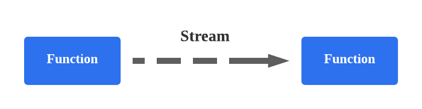
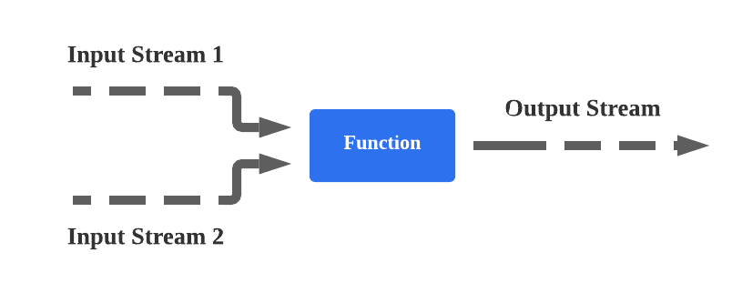
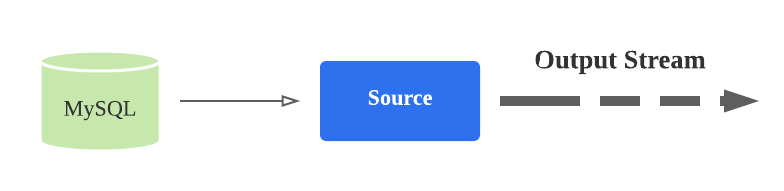
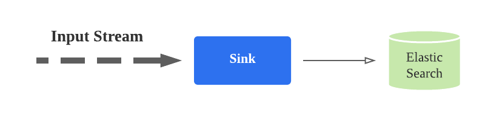
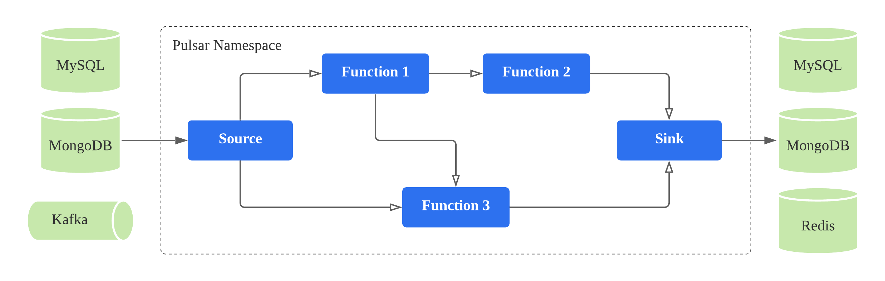
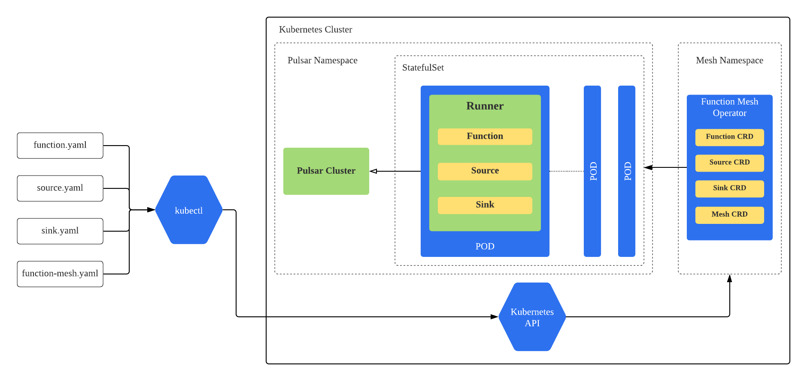

Function Mesh is a serverless framework purpose-built for stream processing applications. It brings powerful event-streaming capabilities to your applications by orchestrating multiple [Pulsar Functions](/functions/function-overview.md) and [Pulsar IO connectors](/connectors/pulsar-io-overview.md) for complex stream processing jobs.

## Concepts

Function Mesh enables you to build event streaming applications leveraging your familiarity with [Apache Pulsar](https://pulsar.apache.org/) and mordern stream processing technologies. Three concepts are foundational to build an application: _streams_, _functions_, and _connectors_.

### Stream

A stream is a partitioned, immutable, append-only sequence for events that represents a series of historical facts. For example, the events of a stream could model a sequence of financial transactions, like "Jack sent $100 to Alice", followed by "Alice sent $50 to Bob". 

A stream is used for connecting **functions** and **connectors**. 

Topics in a messaging system are usually used for presenting the streams. The streams in Function Mesh are implemented by using topics in Apache Pulsar.

Figure 1 illustrates a **stream**.

Figure 1. A stream that connects a **function** and a **connector**

### Function

A **function** is a lightweight event processor that consumes messages from one or more input streams, applies a user-supplied processing logic to one or multiple messages, and produces the results of the processing logic to another stream.

The **functions** in Function Mesh are implemented based on Pulsar Functions.

Figure 2 illustrates a **function**.

Figure 2. A function that consumes messages from one or more input streams and produces the results to another output stream

### Connector

A **connector** is a processor that ingresses or egresses events from and to **streams**. There are two types of connectors in Function Mesh:

- *Source Connector (aka Source)*: a processor that ingests events from an external data system into a **stream**.
- *Sink Connector (aka Sink)*: a processor that egresses events from **streams** to an external data system.

The **connectors** in Function Mesh are implemented based on Pulsar IO connectors. The available Pulsar I/O connectors can be found at [StreamNative Hub](https://hub.streamnative.io/).

Figure 3 illustrates a source **connector**.

Figure 3. A source connector that consumes change events from MySQL and ingests them to an output **streams**

Figure 4 illustartes a sink **connector**.

Figure 4. A sink connector that egresses events from **streams** to ElasticSearch

### FunctionMesh

A **FunctionMesh** (aka Mesh) is a collection of **functions** and **connectors** connected by **streams** that are orchestrated together for achieving powerful stream processing logics.

All the **functions** and **connectors** in a **FunctionMesh** share the same lifecycle. They are started when a **FunctionMesh** is created and terminated when the mesh is destroyed. All the event processors are long running processes. They are auto-scaled based on the workload by the Function Mesh controller.

A **FunctionMesh** can be either a Directed Acyclic Graph (DAG) or a cyclic graph of functions and/or connectors connected with streams. Figure 5 illustrates a **FunctionMesh** of a Debezium source connector, an enrichement function, and an Elastic sink connector.

Figure 5. A FunctionMesh is a collection of functions and/or connectors connected with streams

## API

Function Mesh APIs build on existing Kubernetes APIs, so that Function Mesh resources are compatible with other Kubernetes-native resources, and can be managed by cluster administrators using existing Kubernetes tools.

Common languages and frameworks that include Kubernetes-friendly tooling work smoothly with Function Mesh to reduce the time spent solving common deployment issues.

The foundational concepts described above are delivered as Kubernetes Custom Resource Definitions (CRDs), which can be configured by a cluster administrator for developing event streaming applications.

The available Function Mesh CRDs are:

- [**Function**](/reference/crd-config/function-crd.md): The `Function` resource automatically manages the whole lifecycle of a Pulsar Function.
- [**Source**](/reference/crd-config/source-crd-config.md): The `Source` resource automatically manages the whole lifecycle of a Pulsar Source connector.
- [**Sink**](/reference/crd-config/sink-crd-config.md): The `Sink` resource automatically manages the whole lifecycle of a Pulsar Sink connector.
- [**FunctionMesh**](/reference/crd-config/function-mesh-crd.md): The `FunctionMesh` resource automatically manages the whole lifecycle of your event streaming application. It controls the creation of other objects to ensure that the **functions** and **connectors** defined in your mesh are running and they are connected via the defined **streams**. 

A typical user workflow is illustrated in Figure 6.

1. A user creates a CRD yaml to define the **function**, **connector**, or **mesh** to run.
2. The user submits the CRD using the Kubernetes tooling.
3. The Function Mesh controller watches the CRD and creates Kubernetes resources to run the defined **function**, **connector**, or **mesh**.

The benefit of this approach is both the function metadata and function running state are directly stored and managed by Kubernetes to avoid the inconsistency problem that was seen using Pulsar's existing Kubernetes scheduler. See [Why Function Mesh](/overview/why-function-mesh.md) for more details.

Figure 6. The Function Mesh user workflow

## Architecture

Figure 7 illustrates the overall architecture of Function Mesh.  Function Mesh consists of two components.

- **Controller**: A Kubernetes operator that watches Function Mesh CRDs and creates Kubernetes resources (i.e. StatefulSet) to run **functions**, **connectors**, and **meshes** on Kubernetes.
- **Runner**: A Function Runner that invokes **functions** and **connectors** logic when receiving events from input streams and produces the results to output streams. It is currently implemented using **Pulsar Functions** runner.

When a user creates a Function Mesh CRD, the controller receives the submitted CRD from Kubernetes API server. The controller processes the CRD and generates the corresponding Kubernetes resources. For example, when the controller processes the **Function** CRD, it creates a StatefulSet to run the function. Each pod of this function StatefulSet will launch a *Runner* to invoke the function logic.

Figure 7. The Function Mesh architecture

## Features

- Be easily deployed directly on Kubernetes clusters, including [Minikube](https://github.com/kubernetes/minikube) and [Kind](https://kind.sigs.k8s.io/docs/user/quick-start/), without special dependencies.
- Use [CustomResourceDefinitions (CRD)](https://kubernetes.io/docs/concepts/extend-kubernetes/api-extension/custom-resources/) to define Functions, source, sink, and Mesh. Using CRD makes Function Mesh naturally integrate with the Kubernetes ecosystem.
- Integrate with Kubernetes secrets seamlessly to read secrets directly. This helps improve the overall security for the Pulsar Functions.
- Leverage the Kubernetes's auto-scaler to auto-scale instances for functions based on the CPU and memory usage.
- Utilize the full power scheduling capability provided by Kubernetes. Therefore, you do not need to write any customized codes to communicate with the Kubernetes API server.
- Allow one function to talk to multiple different Pulsar clusters, which are defined as config maps.
- Support the function registry for function package management. The function package can be reused by different functions.

## Documentation

- Overview
  - [What is Function Mesh](/overview/overview.md)
  - [Why Function Mesh](/overview/why-function-mesh.md)
- [Installation](/install-function-mesh.md)
- Functions
  - [Pulsar Functions overview](/functions/function-overview.md)
  - Package Pulsar Functions
    - [Overview](/functions/package-function/package-function-overview.md)  
    - [Package Java Functions](/functions/package-function/package-function-java.md)
    - [Package Python Functions](/functions/package-function/package-function-python.md)
    - [Package Go Functions](/functions/package-function/package-function-go.md)  
  - Run Pulsar Functions
    - [Run Java Functions](/functions/run-function/run-java-function.md)
    - [Run Python Functions](/functions/run-function/run-python-function.md)
    - [Run Go Functions](/functions/run-function/run-go-function.md)
    - [Run Stateful Functions](/functions/run-function/run-stateful-function.md)
    - [Run Window Functions](/functions/run-function/run-window-function.md)
  - [Monitor Pulsar Functions](/functions/function-monitor.md)
  - [Produce function logs](/functions/produce-function-log.md)
  - [Debug Pulsar Functions](/functions/function-debug.md)
- Connectors
  - [Pulsar connectors overview](/connectors/pulsar-io-overview.md)
  - [Run Pulsar connectors](/connectors/run-connector.md)
  - [Monitor Pulsar connectors](/connectors/pulsar-io-monitoring.md)
  - [Debug Pulsar connectors](/connectors/pulsar-io-debug.md)
- Meshes
  - [Function Mesh overview](/function-mesh/function-mesh-overview.md)
  - [Run Function Mesh](/function-mesh/run-function-mesh.md)
- Function Mesh Worker
  - [Function Mesh Worker service overview](/function-mesh-worker/function-mesh-worker-overview.md)
  - [Deploy Function Mesh Worker service](/function-mesh-worker/deploy-mesh-worker.md)
  - [Manage built-in connectors](/function-mesh-worker/manage-builtin-connectors.md)
- [Scaling](/scaling.md)
- Migration
  - [Migrate Pulsar Functions](/migration/migrate-function.md)
- Reference
  - [Function Mesh Operator configurations](/reference/function-mesh-config.md)
  - CRD configurations
    - [Pulsar Functions CRD configurations](/reference/crd-config/function-crd.md)
    - [Source CRD configurations](/reference/crd-config/source-crd-config.md)
    - [Sink CRD configurations](/reference/crd-config/sink-crd-config.md)
    - [Function Mesh CRD configurations](/reference/crd-config/function-mesh-crd.md)
  - Function Mesh Worker configurations
    - [General options](/reference/function-mesh-worker/general-option.md)
    - [Customizable options](/reference/function-mesh-worker/customizable-option.md)
    - [REST APIs](/reference/function-mesh-worker/rest-api.md)
- Releases
  - [Release notes v0.14.0](/releases/release-note-0-14-0.md)
  - [Release notes v0.13.0](/releases/release-note-0-13-0.md)
  - [Release notes v0.12.0](/releases/release-note-0-12-0.md)
  - [Release notes v0.11.0](/releases/release-note-0-11-0.md)
  - [Release notes v0.10.0](/releases/release-note-0-10-0.md)
  - [Release notes v0.9.0](/releases/release-note-0-9-0.md)
  - [Release notes v0.8.0](/releases/release-note-0-8-0.md)
  - [Release notes v0.7.0](/releases/release-note-0-7-0.md)
  - [Release notes v0.6.0](/releases/release-note-0-6-0.md)
  - [Release notes v0.5.0](/releases/release-note-0-5-0.md)
  - [Release notes v0.4.0](/releases/release-note-0-4-0.md)
  - [Release notes v0.3.0](/releases/release-note-0-3-0.md)
  - [Release notes v0.2.0](/releases/release-note-0-2-0.md)
  - [Release notes v0.1.11](/releases/release-note-0-1-11.md)
  - [Release notes v0.1.9](/releases/release-note-0-1-9.md)
  - [Release notes v0.1.8](/releases/release-note-0-1-8.md)
  - [Release notes v0.1.7](/releases/release-note-0-1-7.md)
  - [Release notes v0.1.6](/releases/release-note-0-1-6.md)
  - [Release notes v0.1.5](/releases/release-note-0-1-5.md)
  - [Release notes v0.1.4](/releases/release-note-0-1-4.md)