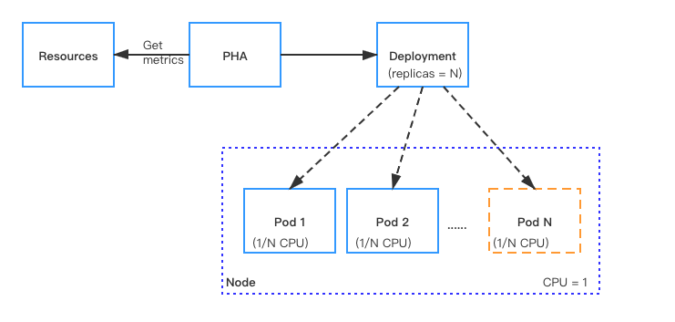

Autoscaling monitors your Pods and automatically adjusts capacity to maintain steady, predictable performance at the lowest possible cost. With autoscaling, it is easy to set up Pods scaling for resources in minutes. The service provides a simple, powerful user interface that lets you build scaling plans for resources.

This document describes how to scale Pods (Pulsar instances) which are used for running functions, sources, and sinks.

## How it works

With Kubernetes [Horizontal Pod Autoscaler (HPA)](https://kubernetes.io/docs/tasks/run-application/horizontal-Pod-autoscale/), Function Mesh supports automatically scaling the number of Pods (Pulsar instances) that are required to run for Pulsar functions, sources, and sinks.

For resources with HPA configured, the HPA controller monitors the resource's Pods to determine if it needs to change the number of Pod replicas. In most cases, where the controller takes the mean of a per-pod metric value, it calculates whether adding or removing replicas would move the current value closer to the target value.



## Manual scaling

In CRDs, the `replicas` parameter is used to specify the number of Pods (Pulsar instances) that are required for running Pulsar functions, sources, or sinks. You can set the number of Pods based on the CPU threshold. When the target CPU threshold is reached, you can scale the Pods manually through either of the two ways:

- Use the `kubectl scale --replicas` command. The CLI command does not change the `replicas` configuration in the CRD. If you use the `kunectl apply -f` command to re-submit the CRD file, the CLI configuration may be overwritten.

    ```bash
    kubectl scale --replicas="" pod/POD_NAME
    ```

- Update the value of the `replicas` parameter in the CRD and re-submit the CRD with the `kubectl apply -f` command.

## Autoscaling

Function Mesh supports scaling Pods (Pulsar instances) based on the CPU utilization automatically. By default, autoscaling is disabled (The value of the `maxReplicas` parameter is set to `0`). To enable autoscaling, you can specify the `maxReplicas` parameter and set a value for it in the CRD. This value should be greater than the value of the `replicas` parameter.

### Auto-scale Pulsar Functions

This example shows how to auto-scale the number of Pods running Pulsar Functions to `8`.

1. Specify the the `maxReplicas` to `8` in the Pulsar Functions CRD. The `maxReplicas` refers to the maximum number of Pods that are required for running the Pulsar Functions.

    ```yml
    apiVersion: cloud.streamnative.io/v1alpha1
    kind: Function
    metadata:
      name: java-function-sample
      namespace: default
    spec:
      className: org.apache.pulsar.functions.api.examples.ExclamationFunction
      forwardSourceMessageProperty: true
      MaxPendingAsyncRequests: 1000
      replicas: 1
      maxReplicas: 8
      logTopic: persistent://public/default/logging-function-logs
      input:
        topics:
        - persistent://public/default/java-function-input-topic
        typeClassName: java.lang.String
      output:
        topic: persistent://public/default/java-function-output-topic
        typeClassName: java.lang.String
      # Other function configs
    ```

2. Apply the configurations.

    ```bash
    kubectl apply -f path/to/source-sample.yaml
    ```

### Auto-scale Pulsar connectors

This example shows how to auto-scale the number of Pods for running a Pulsar source connector to `5`.

1. Specify the the `maxReplicas` to `5` in the Pulsar source CRD. The `maxReplicas` refers to the maximum number of Pods that are required for running the Pulsar source connector.

    **Example**

    ```yml
    apiVersion: compute.functionmesh.io/v1alpha1
    kind: Source
    metadata:
      name: source-sample
    spec:
      className: org.apache.pulsar.io.debezium.mongodb.DebeziumMongoDbSource
      replicas: 1
      maxReplicas: 5
      replicas: 1
      maxReplicas: 1
      output:
        producerConf:
          maxPendingMessages: 1000
          maxPendingMessagesAcrossPartitions: 50000
          useThreadLocalProducers: true
        topic: persistent://public/default/destination
        typeClassName: org.apache.pulsar.common.schema.KeyValue
      resources:
        limits:
          cpu: "0.2"
          memory: 1.1G
        requests:
          cpu: "0.1"
          memory: 1G
      # Other configurations
    ```

2. Apply the configurations.

    ```bash
    kubectl apply -f path/to/source-sample.yaml
    ```