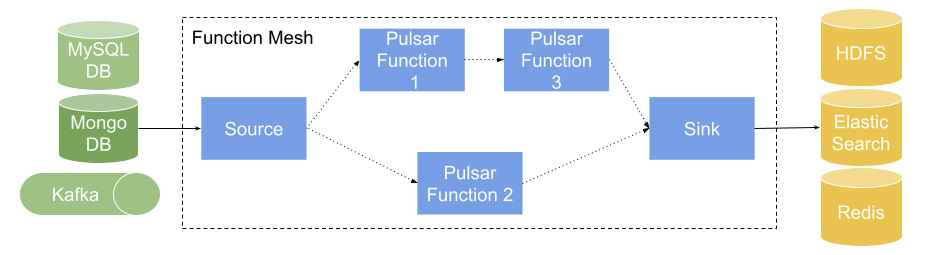

This document gives a brief introduction into Function Mesh.

## What is Function Mesh

Function Mesh is a Kubernetes operator that enables users to run Pulsar Functions and Pulsar connectors natively on Kubernetes, unlocking the full power of Kubernetes' features and resources.

By providing a Kubernetes operator dedicated to Pulsar Functions, Function Mesh simplifies the maintenance of running Pulsar Functions as well as the complexity of creating the complex function topology. Function Mesh is a valuable tool for users who are seeking cloud-native serverless streaming solutions. Key benefits include:

- Utilize the full power of Kubernetes to provision, schedule, and even auto-scale Pulsar Functions and Pulsar IO connectors.

- Run Pulsar Functions and Pulsar IO connectors natively in the cloud environment, which leads to greater possibilities when more resources become available in the cloud.

## How Function Mesh works

Function Mesh is designed to run Pulsar Functions and connectors natively on Kubernetes. Instead of using the `pulsar-admin` CLI tool to send function requests to Pulsar clusters, you can use `kubectl` to submit a Function Mesh CRD directly to Kubernetes clusters. The installed Function Mesh operator launches functions and connectors individually, organize scheduling, and load balance them together.

Function Mesh stores both the functions and connectors metadata and running status directly in Kubernetes.

1. Create Pulsar Functions, source, sink, and Function Mesh `.yaml` files as CRDs.

2. The Functions controller receives CRDs from Kubernetes service and then schedules the individual pod for running function/connector instances.

3. The running function/connector instances run with the configured Pulsar cluster and topics.

The following diagram illustrates how Function Mesh works.

