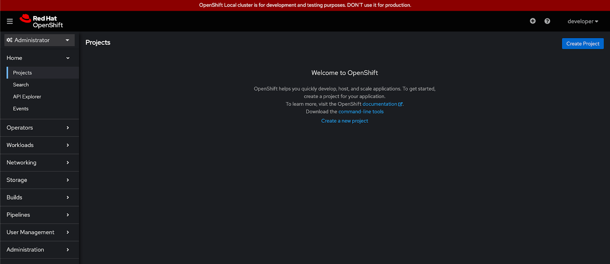
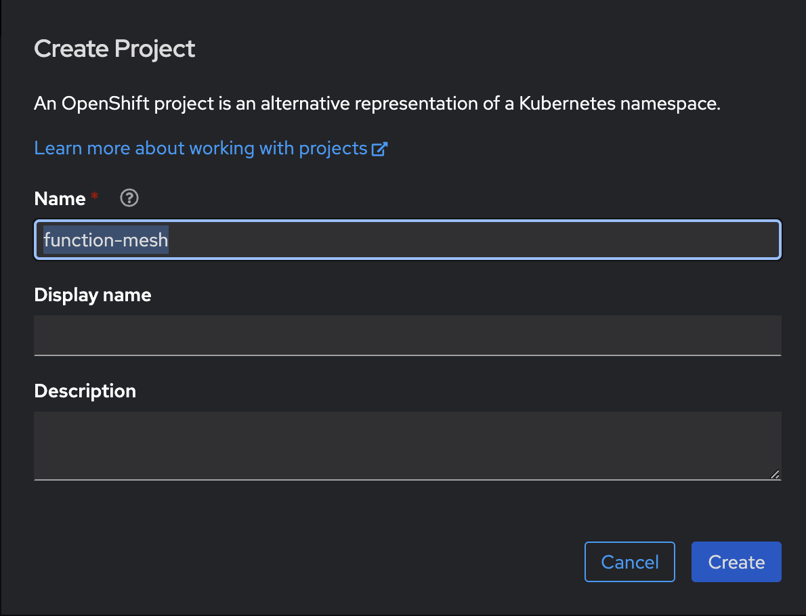
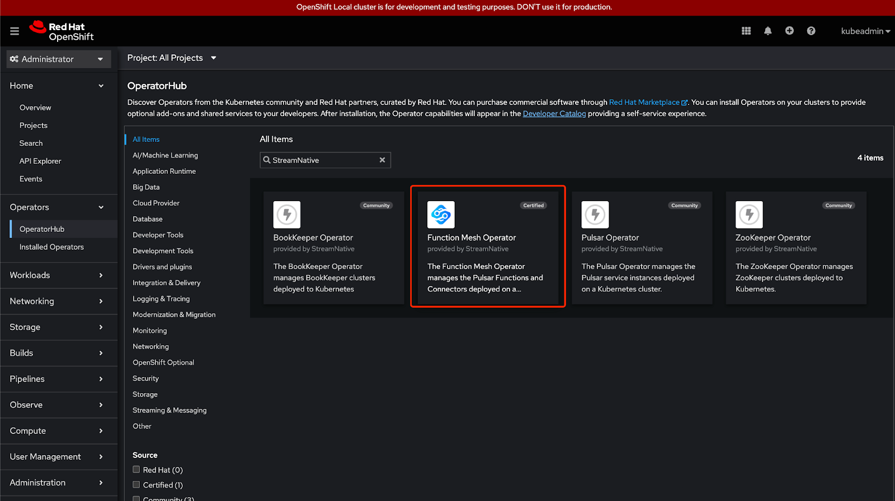
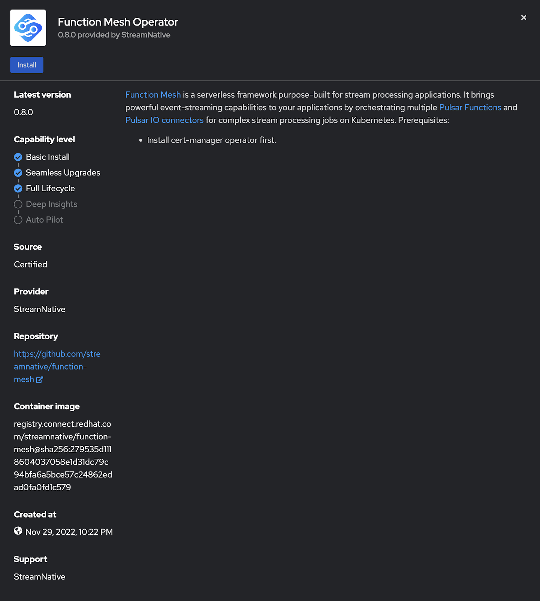
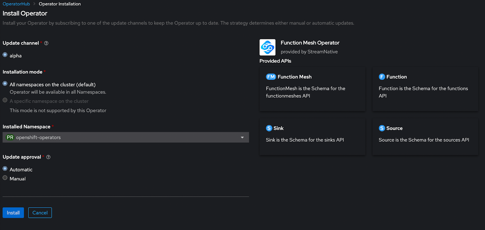
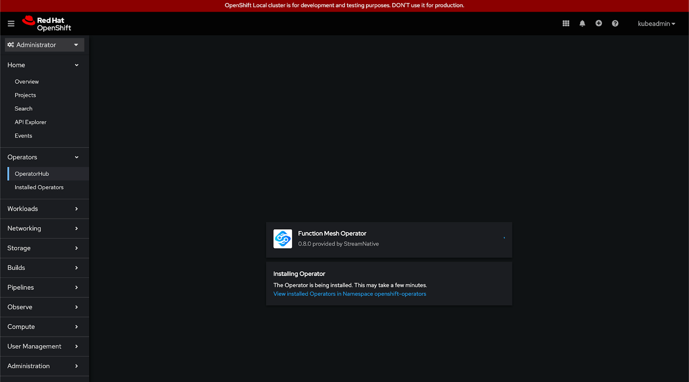
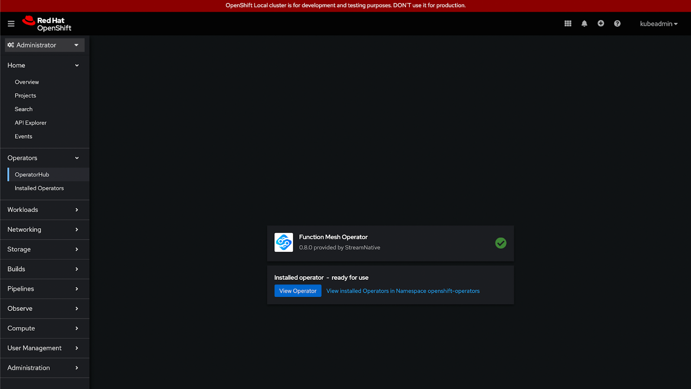

This document describes how to install Function Mesh based on your application in Kubernetes.

## Install Function Mesh

This section describes how to install Function Mesh through the `install.sh` script or through the Helm.

### Prerequisites

Before installing Function Mesh, ensure to perform the following operations.

- Kubernetes server v1.17 or higher.
- Create and connect to a [Kubernetes cluster](https://kubernetes.io/).
- Create a [Pulsar cluster](https://pulsar.apache.org/docs/en/kubernetes-helm/) in the Kubernetes cluster.
- Deploy [Pulsar Functions](https://pulsar.apache.org/docs/en/functions-overview/).
- Install [Helm v3](https://helm.sh/docs/intro/install/).
- (Optional) enable [Role-based Access Control (RBAC)](https://kubernetes.io/docs/reference/access-authn-authz/rbac/).

### Install cert-manager

By default, Function Mesh is enabled with the [admission control webhook](https://kubernetes.io/docs/reference/access-authn-authz/extensible-admission-controllers/#what-are-admission-webhooks). Therefore, you need to prepare the relevant signed certificates. Secrets that contain signed certificates are named with the fixed name `function-mesh-admission-webhook-server-cert`, which is controlled by the [Certificate CRD](https://cert-manager.io/docs/concepts/certificate/).

It is recommended to use [cert-manager](https://cert-manager.io/) to manage these certificates and you can install the cert-manager as follows.

```shell
helm repo add jetstack https://charts.jetstack.io
helm repo update
helm install \
  cert-manager jetstack/cert-manager \
  --namespace cert-manager \
  --create-namespace \
  --version v1.8.0 \
  --set installCRDs=true
```

### Install Function Mesh through `install.sh` script

> **Note**
>
> The `install.sh` command is suitable for trying Function Mesh out. If you want to deploy Function Mesh in production or other mission-critical scenarios, it is recommended to install Function Mesh through Helm.

This example shows how to use the `install.sh` command to install Function Mesh on your laptop (Linux or Mac OS), including a local [kind](https://kind.sigs.k8s.io/) cluster, all the Custom Resource Definitions (CRDs), required service account configuration, and Function Mesh components.

```shell
curl -sSL https://github.com/streamnative/function-mesh/releases/download/v0.15.0/install.sh | bash
```

After executing the above command, you should be able to see the output indicating that the Function Mesh pod is up and running. For details, see [verify installation](#verify-installation).

### Install Function Mesh through Helm

This example shows how to install Function Mesh through [Helm](https://helm.sh/).

> **Note**
>
> For the use of `kubectl` commands, see [kubectl command reference](https://kubernetes.io/docs/reference/generated/kubectl/kubectl-commands).

1. Add the StreamNative Function Mesh repository.

    ```shell
    helm repo add function-mesh http://charts.functionmesh.io/
    helm repo update
    ```

2. Install the Function Mesh Operator.

    1. Set some variables for convenient use later.

        ```shell
        export FUNCTION_MESH_RELEASE_NAME=function-mesh  # change the release name according to your scenario
        export FUNCTION_MESH_RELEASE_NAMESPACE=function-mesh  # change the namespace to where you want to install Function Mesh
        ```

    2. Install the Function Mesh Operator.

        > **Note**
        >
        > - If no Kubernetes namespace is specified, the `default` namespace is used.
        > - If the `${FUNCTION_MESH_RELEASE_NAMESPACE}` namespace does not exist, you can create the Kubernetes cluster using the `--create-namespace` parameter.

        ```shell
        helm install ${FUNCTION_MESH_RELEASE_NAME} function-mesh/function-mesh-operator -n ${FUNCTION_MESH_RELEASE_NAMESPACE}
        ```

    There are some configurable parameters of the Function Mesh Operator. For details, see [Function Mesh Operator configurations](/reference/function-mesh-config.md).

3. Check whether Function Mesh is installed successfully.

    ```shell
    kubectl get pods -n ${FUNCTION_MESH_RELEASE_NAMESPACE} -l app.kubernetes.io/instance=function-mesh
    ```

    **Output**

    ```
    NAME                                               READY   STATUS    RESTARTS   AGE
    function-mesh-controller-manager-5f867557c-d6vf4   1/1     Running   0          8s
    ```

### Install Function Mesh using OLM

This section describes how to install Function Mesh using [Operator Lifecycle Manage](https://olm.operatorframework.io/). OLM is a tool to manage the Operators running on your cluster.

1. Install the Operator Lifecycle Manager (OLM).

    ```bash
    curl -sL https://github.com/operator-framework/operator-lifecycle-manager/releases/download/v0.24.0/install.sh | bash -s v0.24.0
    ```

2. Define a manifest.

    Here is a sample YAML file.

    ```yaml
    apiVersion: operators.coreos.com/v1alpha1
    kind: Subscription
    metadata:
      name: my-function-mesh
      namespace: operators
    spec:
      channel: alpha
      name: function-mesh
      source: operatorhubio-catalog
      sourceNamespace: olm
      config:
        env:
        - name: 
          value: 
    ```

3. Install the Function Mesh Operator.

    ```bash
    kubectl create -f <path/to/your/yaml/file>
    ```

    The Function Mesh Operator will be installed in the **operators** namespace and will be used for all namespaces in the cluster.

4. Check whether Function Mesh is installed successfully.

    ```bash
    kubectl get csv -n operators
    ```

### Install Function Mesh using OpenShift Web Console

This section describes how to install Function Mesh using the OpenShift Web Console.

1. Navigate to your OpenShift Web Console and login to the OpenShift cluster as an Administrator role.

    

2. Create a new project or select an existing one.

    

3. Find the Operators on the OperatorHub of OpenShift. You can search for the keyword "FunctionMesh" or "StreamNative".

    

4. Click the **Function Mesh Operator** tile, and then click **Install**.

    

5. Customize the configurations.

      - **Installation mode**
          - **All namespaces on the cluster (default)**: deploy the Function Mesh Operator with cluster-scoped permissions.
          - **A specific namespace on the cluster**: deploy the PulFunction Meshsar Operator with namespace-scoped permissions.
      - **Updated Approval**
          - **Automatic**: automatically install or update the Function Mesh Operator.
          - **Manual**: manually install or update the Function Mesh Operator.

    

6. Click **Install**. A page displays, showing the Function Mesh Operator installation process.

    

7. After the Operator is installed, you can see the new status **Installed operator - ready for use**.

    

## Verify installation

- This example shows how to verify whether Function Mesh is installed successfully.

    ```shell
    kubectl get pods -n ${FUNCTION_MESH_RELEASE_NAMESPACE} -l app.kubernetes.io/instance=function-mesh
    ```

    **Output**

    ```
    NAME                                               READY   STATUS    RESTARTS   AGE
    function-mesh-controller-manager-5f867557c-d6vf4   1/1     Running   0          8s
    ```

- This example shows how to verify whether Function Mesh can run properly.

    After installing the Function Mesh Operator and deploying a Pulsar cluster, you can submit a sample CRD to create Pulsar Functions, source, sink, or Function Mesh. In this example, a CRD is submitted to the Pulsar cluster for creating a Pulsar Function. You can also submit other CRDs under the `./config/samples` directory.
    
    1. Update your Pulsar cluster configurations in the CRD.
      
       ```yaml
       # in config/samples/compute_v1alpha1_function.yaml
       ...
       apiVersion: v1
         kind: ConfigMap
         metadata:
         name: test-pulsar
         data:
           webServiceURL: http://<YOUR_PULSAR_URL>:8080
           brokerServiceURL: pulsar://<YOUR_PULSAR_URL>:6650
       ...
       ```

    2. Submit a sample CRD to the Pulsar cluster.

        ```bash
        kubectl apply -n ${FUNCTION_MESH_RELEASE_NAMESPACE} -f config/samples/compute_v1alpha1_function.yaml
        ```

    3. Verify your submission with the `kubectl` command, and you can see that the Function pod is running.

        ```bash
        kubectl get all
        NAME                                READY   STATUS      RESTARTS   AGE
        pod/function-sample-0               1/1     Running     0          77s
        ```

## Uninstall Function Mesh

1. Use the following command to uninstall Function Mesh through Helm.

    ```bash
    helm delete function-mesh -n ${FUNCTION_MESH_RELEASE_NAMESPACE}
    ```

2. Remove the Secrets that contain the signed certificates.

    > **Note**
    >
    > If you do not clean up the Secrets, you might fail to install the Function Mesh Operator in this environment. For details about how to automatically clean up the corresponding Secrets when you delete a Certificate, see [Cleaning up Secrets when Certificates are deleted](https://cert-manager.io/docs/usage/certificate/#cleaning-up-secrets-when-certificates-are-deleted).

    ```shell
    kubectl delete secret function-mesh-admission-webhook-server-cert -n ${FUNCTION_MESH_RELEASE_NAMESPACE}
    ```