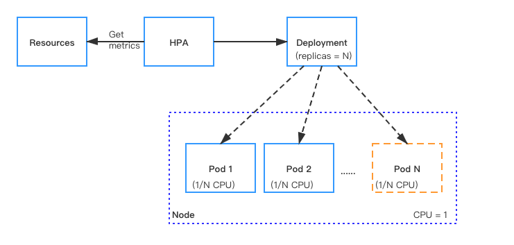

This document describes how to manually and automatically scale Pods (Pulsar instances) that are used for running functions, sources, and sinks.

## Manual scaling

In CRDs, the `replicas` parameter is used to specify the number of Pods (Pulsar instances) that are required for running Pulsar functions, sources, or sinks. You can set the number of Pods based on the CPU threshold. When the target CPU threshold is reached, you can scale the Pods manually through either of the two ways:

- Use the `kubectl scale --replicas` command. The CLI command does not change the `replicas` configuration in the CRD. If you use the `kubectl apply -f` command to re-submit the CRD file, the CLI configuration may be overwritten.

    ```bash
    kubectl scale --replicas="" pod/POD_NAME
    ```

- Update the value of the `replicas` parameter in the CRD and re-submit the CRD with the `kubectl apply -f` command.

## Autoscaling

Autoscaling monitors your Pods and automatically adjusts capacity to maintain steady, predictable performance at the lowest possible cost. With autoscaling, it is easy to set up Pods scaling for resources in minutes. The service provides a simple, powerful user interface that lets you build scaling plans for resources.

### How it works

With Kubernetes [Horizontal Pod Autoscaler (HPA)](https://kubernetes.io/docs/tasks/run-application/horizontal-Pod-autoscale/), Function Mesh supports automatically scaling the number of Pods (Pulsar instances) that are required to run Pulsar functions, sources, and sinks.

For resources with HPA configured, the HPA controller monitors the resource's Pods to determine if it needs to change the number of Pod replicas. In most cases, where the controller takes the mean of a per-pod metric value, it calculates whether adding or removing replicas would move the current value closer to the target value.



### Supported auto-scaling metrics

Function Mesh auto-scales the number of Pods based on the CPU usage, memory usage, and custom metrics.

> **Note**
>
> If you have configured autoscaling based on the CPU usage and/or memory usage, you do not need to configure autoscaling based on custom metrics defined in Pulsar Functions or connectors and vice versa.

- CPU usage: auto-scale the number of Pods based on CPU utilization.
  
  This table lists built-in CPU-based autoscaling metrics. If these metrics do not meet your requirements, you can auto-scale the number of Pods based on custom metrics defined in Pulsar Functions or connectors. For details, see [MetricSpec v2beta2 autoscaling](https://kubernetes.io/docs/reference/generated/kubernetes-api/v1.21/#metricspec-v2beta2-autoscaling).
  
  | Option | Description |
  | --- | --- |
  | AverageUtilizationCPUPercent80 | Auto-scale the number of Pods if 80% CPU is used.|
  | AverageUtilizationCPUPercent50 | Auto-scale the number of Pods if 50% CPU is used.|
  | AverageUtilizationCPUPercent20 | Auto-scale the number of Pods if 20% CPU is used. |

- Memory usage: auto-scale the number of Pods based on memory utilization.
  
  This table lists built-in memory-based autoscaling metrics. If these metrics do not meet your requirements, you can auto-scale the number of Pods based on custom metrics defined in Pulsar Functions or connectors. For details, see [MetricSpec v2beta2 autoscaling](https://kubernetes.io/docs/reference/generated/kubernetes-api/v1.21/#metricspec-v2beta2-autoscaling).
  
  | Option | Description |
  | --- | --- |
  | AverageUtilizationMemoryPercent80 | Auto-scale the number of Pods if 80% memory is used. |
  | AverageUtilizationMemoryPercent50 | Auto-scale the number of Pods if 50% memory is used. |
  | AverageUtilizationMemoryPercent20 | Auto-scale the number of Pods if 20% memory is used. |

- Custom metrics: auto-scale the number of Pods based on custom metrics defined in Pulsar Functions or connectors. For details, see [MetricSpec v2beta2 autoscaling](https://kubernetes.io/docs/reference/generated/kubernetes-api/v1.21/#metricspec-v2beta2-autoscaling).

### Examples

This section provides some examples about autoscaling.

#### Prerequisites

Deploy the metrics server in the cluster. The Metrics server provides metrics through the Metrics API. The Horizontal Pod Autoscaler (HPA) uses this API to collect metrics. To learn how to deploy the metrics-server, see the [metrics-server documentation](https://github.com/kubernetes-sigs/metrics-server#deployment).

#### Enable autoscaling

By default, autoscaling is disabled (the value of the `maxReplicas` parameter is set to `0`). To enable autoscaling, you can specify the `maxReplicas` parameter and set a value for it in the CRD. This value should be greater than the value of the `replicas` parameter.

By default, when autoscaling is enabled, the number of Pods is automatically scaled when 80% CPU is used.

This example shows how to enable autoscaling by setting the value of the `maxReplicas` to `8`.

```yaml
apiVersion: cloud.streamnative.io/v1alpha1
kind: Function
metadata:
  name: java-function-sample
  namespace: default
spec:
  className: org.apache.pulsar.functions.api.examples.ExclamationFunction
  forwardSourceMessageProperty: true
  maxPendingAsyncRequests: 1000
  replicas: 1
  maxReplicas: 8
  # Other function configs
```

#### Configure autoscaling with built-in metrics

Function Mesh supports autoscaling the number of Pods based on [supported built-in metrics](#supported-auto-scaling-metrics).

  >**Note**
  >
  > If you specify multiple metrics for the HPA to scale up, the HPA controller evaluates each metric, and proposes a new scale based on that metric. The largest of the proposed scales will be used as the new scale.

This example shows how to auto-scale the number of Pods to `8` when 20% CPU is used.

1. Specify the CPU-based autoscaling metric under `pod.builtinAutoscaler` in the Pulsar Functions CRD.

    ```yaml
    apiVersion: cloud.streamnative.io/v1alpha1
    kind: Function
    metadata:
      name: java-function-sample
      namespace: default
    spec:
      className: org.apache.pulsar.functions.api.examples.ExclamationFunction
      forwardSourceMessageProperty: true
      maxPendingAsyncRequests: 1000
      replicas: 1
      maxReplicas: 4                    --- [1]
      logTopic: persistent://public/default/logging-function-logs                    
      input:                   
        topics:                    
        - persistent://public/default/java-function-input-topic                    
        typeClassName: java.lang.String                    
      pod:                    
        builtinAutoscaler:               --- [2]
          - AverageUtilizationCPUPercent20
      # Other function configs
    ```

    - [1] `maxReplicas`: enables autoscaling when the value is greater than that of the `replicas`.
    - [2] `builtinAutoscaler`: configures the built-in autoscaling metrics.

2. Apply the configurations.

    ```bash
    kubectl apply -f path/to/function-sample.yaml
    ```

#### Configure autoscaling with custom metrics

Function Mesh supports automatically scaling up the number of Pods based on a custom autoscaling metric. 

- This example shows how to auto-scale the number of Pods if 45% CPU is used.

  1. Specify the custom autoscaling metric under `pod.autoScalingMetrics` in the Pulsar Functions CRD.

      ```yaml
      apiVersion: cloud.streamnative.io/v1alpha1
      kind: Function
      metadata:
        name: java-function-sample
        namespace: default
      spec:
        className: org.apache.pulsar.functions.api.examples.ExclamationFunction
        forwardSourceMessageProperty: true
        maxPendingAsyncRequests: 1000
        replicas: 1
        maxReplicas: 4                         --- [1]
        logTopic: persistent://public/default/logging-function-logs            
        pod:            
          autoScalingMetrics:                  --- [2]
          - type: Resource           
            resource:            
              name: cpu                        --- [3]
              target:             
                type: Utilization              
                averageUtilization: 45         --- [4]
        # Other function configs
      ```

      - [1] `maxReplicas`: enables autoscaling when the value is greater than that of the `replicas`.
      - [2] `autoScalingMetrics`: represents the custom autoscaling metrics.
      - [3] `name`: defines the name of resources to be used. It can be set to the value `cpu` or `memory`.
      - [4] `averageUtilization`: defines the percentage of the resource usage.

  2. Apply the configurations.

      ```bash
      kubectl apply -f path/to/function-sample.yaml
      ```

- If a large number of resources are used suddenly, you can use the `autoScalingBehavior.scaleUp.stabilizationWindowSeconds` option to adjust the value of the stabilization window to tune performance.

  1. Specify the value of the stabilization window in the Pulsar Functions CRD.

      ```yaml
      apiVersion: cloud.streamnative.io/v1alpha1
      kind: Function
      metadata:
        name: java-function-sample
        namespace: default
      spec:
        minReplicas: 1
        maxReplicas: 10
        pod:
          autoScalingMetrics:
            - type: Resource
              resource:
                name: cpu
                target:
                  type: Utilization
                  averageUtilization: 80
          autoScalingBehavior:                     
            scaleUp:                               --- [1]
              stabilizationWindowSeconds: 120      --- [2]
              policies:                            --- [3]
              - type: Percent                      --- [4]
                value: 100                         --- [5]
                periodSeconds: 15                  --- [6]
              - type: Pods                         
                value: 4                           
                periodSeconds: 15                  
              selectPolicy: Max                    --- [7]
      ```

     - [1] `scaleUp`: specifies the rules that are used to control scaling behavior while scaling up.
     - [2] `stabilizationWindowSeconds`: indicates the amount of time the HPA controller should consider previous recommendations to prevent flapping of the number of replicas.
     - [3] `policies`: a list of policies that regulate the amount of scaling. Each item has the following fields:
       - [4] `type`: can be set to the value `Pods` or `Percent`, which indicates the allowed changes in terms of absolute number of pods or percentage of current replicas.
       - [5] `periodSeconds`: represents the amount of time in seconds that the rule should hold true for.
       - [6] `value`: represents the value for the policy.
     - [7] `selectPolicy`: can be `Min`, `Max` or `Disabled` and specifies which value from the policies should be selected. By default, it is set to `Max` value.

  2. Apply the configurations.

      ```bash
      kubectl apply -f path/to/function-sample.yaml
      ```